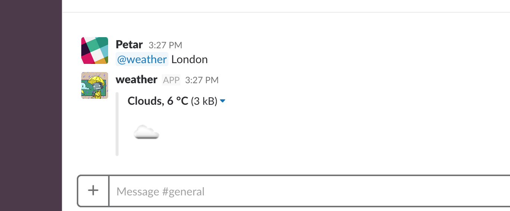
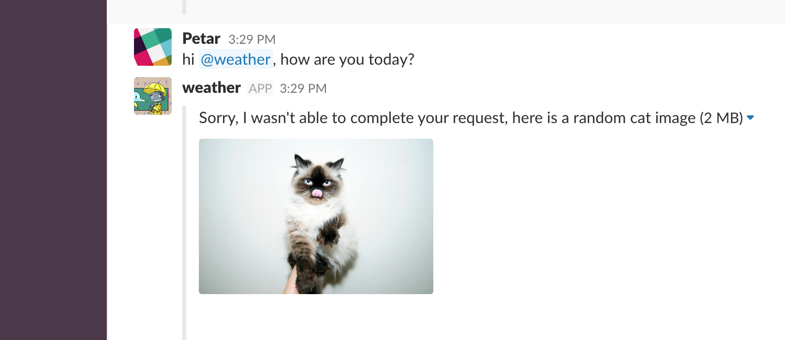

# slack-weather-bot

A very simple slack weather bot written in Node.js.

## Installation

To create a valid slack-bot user and a token please visit https://api.slack.com/bot-users.<br/>
For a valid OpenWeatherMap API key please visit http://openweathermap.org/appid.

```
git clone https://github.com/pkoretic/slack-weather-bot
npm install
SLACK_API_TOKEN=... OPENWEATHER_API_KEY=... npm start
```

If your slack token is valid, and everything went well, inside your slack workspace your bot should
now be online.


Otherwise, please check the logs for clues as to what could have possibly gone wrong.

## Usage

This bot is very simple. To get a current weather information for your city, add the bot to any
wanted channel and mention it with a name of the city. For example: `@weather London`.



This maps directly to the OpenWeatherMap API with a query option `By city name`. Which also supports
providing country code when this is wanted. For example: `@weather Zagreb,hr`. For more details see
https://openweathermap.org/current

Since this bot is fairly simple, a failure is likely to happen. In that case, it will respond
gracefully.



## Implementation

The service uses Node.js [Botkit](https://howdy.ai/botkit) library to communicate with the slack
[Real Time Messaging API](https://api.slack.com/rtm) over websockets.

For OpenWeatherMap API we use our [caching
service](https://github.com/pkoretic/openweathermap-cache-proxy) to minimize latency and number of
requests made to the official API.

## Dockerfile

A convenient docker file is provided.

```
docker build -t slack-weather-bot .
docker run -e SLACK_API_TOKEN=... -e OPENWEATHER_API_KEY=... slack-weather-bot
```
